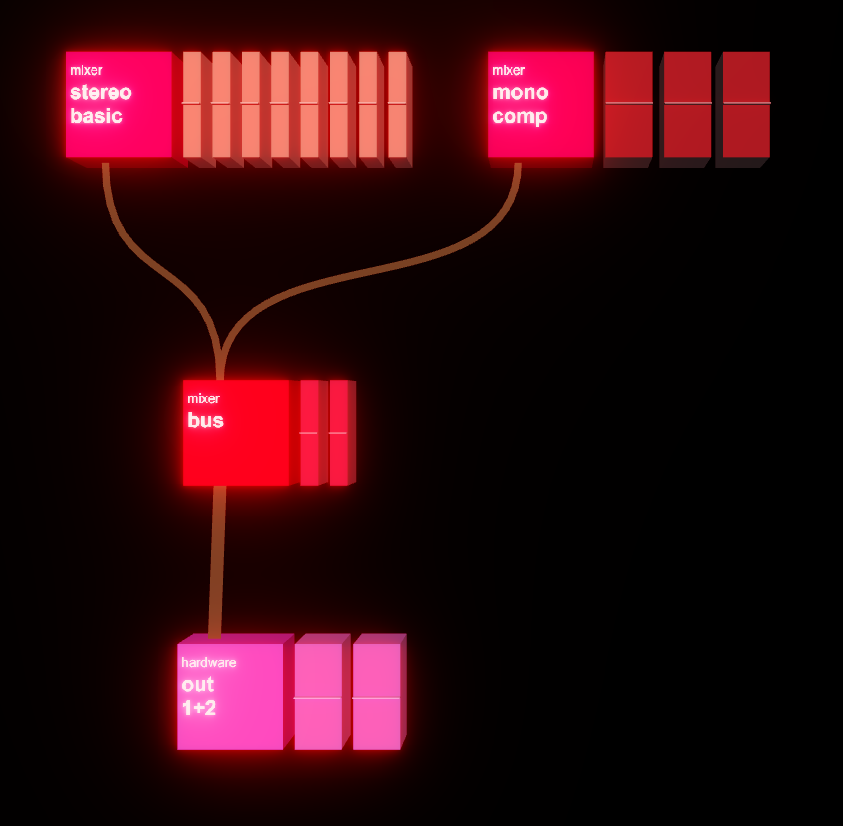

You don't need to structure your patches around a mixer - it's fine to route everything into the main audio outputs if you want - but benny does contain some mixer blocks.

The benny mix blocks use airwindows console 7 for non-linear summing. For this to work, you have to go from the **mix.channel** / **mix.stereo.channel** blocks into a **mix.bus** block, and there can't be anything else inbetween the two and this connection has to be at unity gain. benny takes care of this last constraint. You can add more voices to either kind of channel block to add more channels. The three modes (channel, cascade, crunch) give the channels progressively more aggressive saturation characteristics.

You can assign a midi controller directly to the mixer in the **mix.bus** block.

