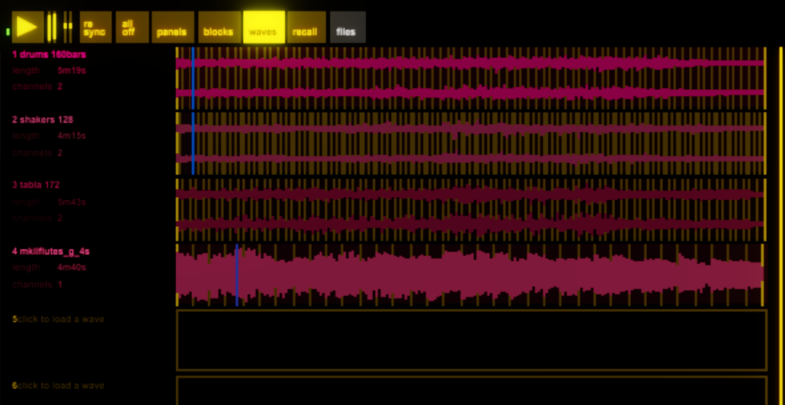
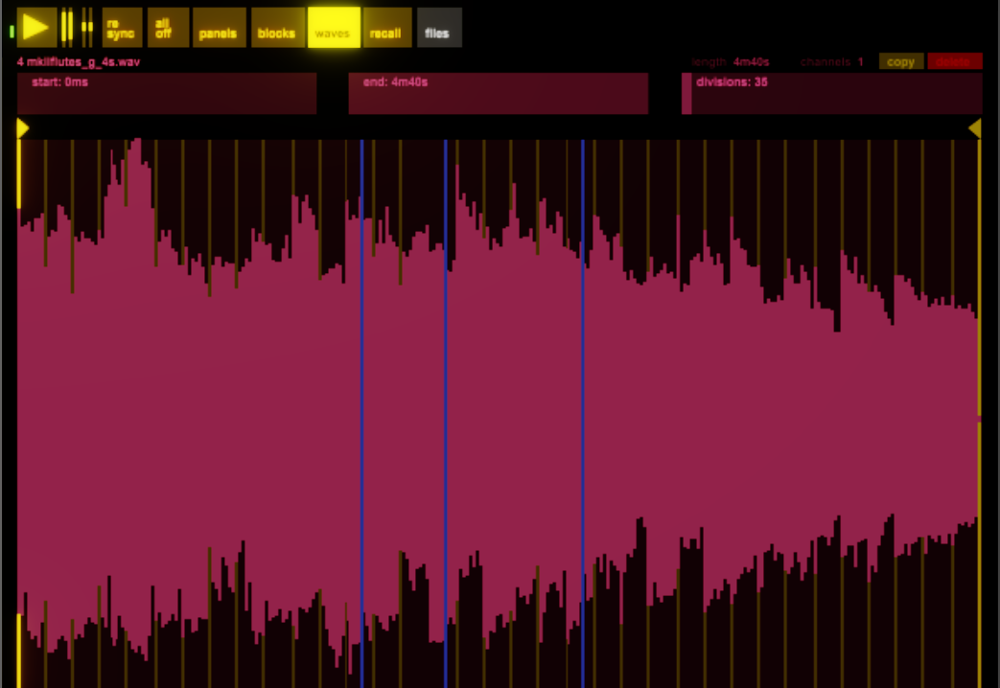

benny keeps all the audio files you use in a centralised repository that all blocks can access. In the waves page you can load in audio files and tag them with timing information.

*This page of benny is one of the less finished areas. Many planned features are not yet implemented.*

## Load a wave

Click an empty slot and a file chooser dialog will pop up to let you choose a wave. It will load up and a pictoral representation of it will appear.

You can also drag and drop audio files or folders onto the benny logo in the launcher window.

Drag to zoom and pan around the wave.

## Slices

*In the future benny will support automatic marker placement and flexible grids with attached metadata.*

At the moment you can only put a fixed grid of slices on your waves. This is essential for blocks like wave.scan and voice.multisample which work with the slices. 

Use the sliders to position the start and end of the grid and choose how many slices there are. Alt+shift + scroll for fine adjust.

